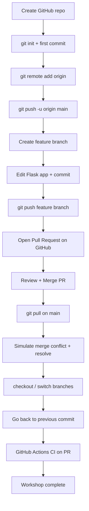
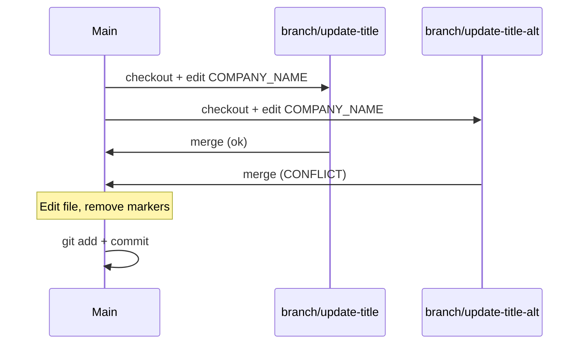
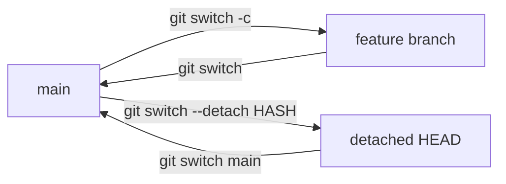
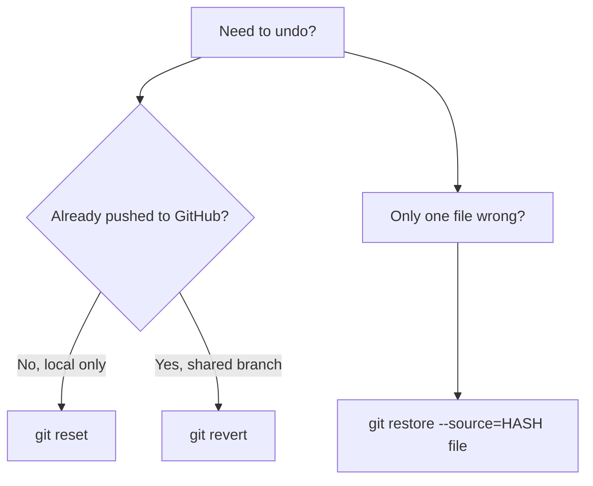
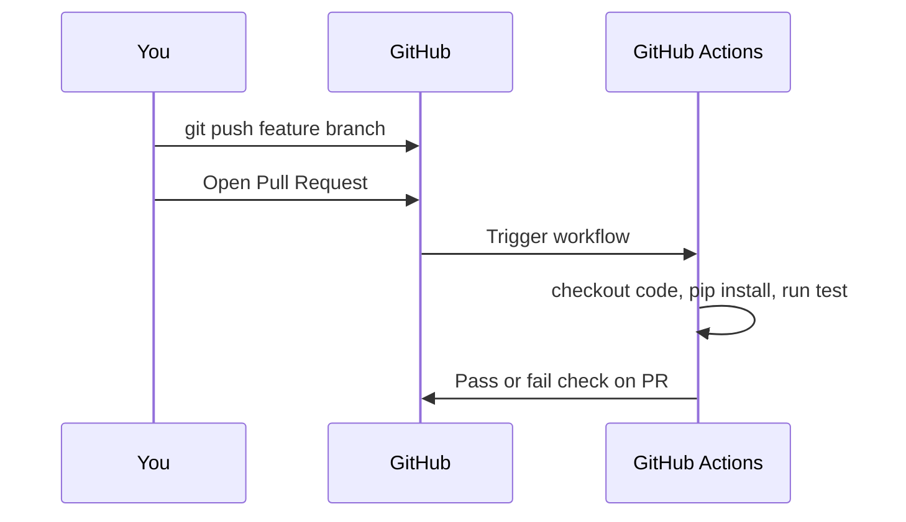

# Git Basics Workshop — 2-Hour Process Flow

> **Goal:** Learn `commit`, `push`, `pull`, `branch`, `merge`, **Pull Request**, `checkout`, **undo / go back to a commit**, and **GitHub Actions** using a simple Flask app that shows dummy employee data.

---

## Before You Start (5 min)

| Item | Action |
|------|--------|
| Git installed | Run `git --version` |
| Python 3.10+ | Run `python --version` |
| GitHub account | Log in at [github.com](https://github.com) |
| GitHub username | Replace `YOUR_GITHUB_USERNAME` everywhere in this workshop |

---

## High-Level Flow (Mermaid)



---

## Timeline Overview

| Time | Block | Git concepts |
|------|-------|--------------|
| 0:00 – 0:20 | Setup & first run | `init`, `status`, `add`, `commit` |
| 0:20 – 0:40 | Connect GitHub | `remote`, `push`, `pull`, `clone` |
| 0:40 – 1:00 | Branching | `branch`, `checkout`, `switch` |
| 1:00 – 1:25 | Pull Request | push branch, PR, code review |
| 1:25 – 1:45 | Merge & sync | merge PR, `git pull`, fast-forward |
| 1:45 – 2:00 | Conflict drill | `merge` conflict, resolve, commit |
| 2:00 – 2:20 | Checkout & switch | `checkout`, `switch`, detached HEAD |
| 2:20 – 2:45 | Undo / go back | `restore`, `reset`, `revert` |
| 2:45 – 3:15 | GitHub Actions | CI workflow, checks on PR |

> **Note:** Blocks 1–6 are the core **2-hour** path. Blocks 7–9 add ~75 min of extended topics.

---

## Block 1 — Setup & First Commit (0:00 – 0:20)

### 1.1 Run the Flask app locally

```powershell
cd d:\skill\basics_of_git
python -m venv venv
.\venv\Scripts\Activate.ps1
pip install -r requirements.txt
python app.py
```

Open **http://127.0.0.1:5000** — you should see the Team Directory table.

### 1.2 Initialize Git

```powershell
git init
git status
```

### 1.3 First commit

```powershell
git add .
git status
git commit -m "Initial commit: Flask team directory with dummy data"
git log --oneline
```

**Checkpoint:** `git log` shows 1 commit. Working tree is clean.

---

## Block 2 — GitHub Remote, Push & Pull (0:20 – 0:40)

### 2.1 Create empty repo on GitHub

1. Go to **GitHub → New repository**
2. Name: `git-basics-workshop` (or any name)
3. **Do NOT** add README, .gitignore, or license (we already have files)
4. Copy the HTTPS URL, e.g. `https://github.com/YOUR_GITHUB_USERNAME/git-basics-workshop.git`

### 2.2 Link remote and push

```powershell
git branch -M main
git remote add origin https://github.com/YOUR_GITHUB_USERNAME/git-basics-workshop.git
git remote -v
git push -u origin main
```

### 2.3 Practice pull (no changes on remote)

```powershell
git pull origin main
```

**Checkpoint:** Repo visible on GitHub with all project files.

---

## Block 3 — Branching (0:40 – 1:00)

### 3.1 Create feature branch

```powershell
git switch -c feature/add-role-badge
git branch
```

### 3.2 Make a small change

Open `templates/index.html` and add a **Role** badge next to each employee name (workshop hint in `WORKSHOP.md`).

```powershell
git status
git diff
git add templates/index.html
git commit -m "Add role badge to employee cards"
```

### 3.3 Push feature branch

```powershell
git push -u origin feature/add-role-badge
```

**Checkpoint:** Branch exists on GitHub. `main` is unchanged locally if you didn't merge yet.

---

## Block 4 — Pull Request (1:00 – 1:25)

### 4.1 Open PR on GitHub

1. GitHub repo → **Compare & pull request**
2. Base: `main` ← Compare: `feature/add-role-badge`
3. Title: `Add role badge to team directory`
4. Description: what you changed and why
5. **Create pull request**

### 4.2 Self-review

- Files changed tab
- Add a comment on one line (optional)
- **Approve** or leave as author

**Checkpoint:** PR is open; CI not required for this workshop.

---

## Block 5 — Merge & Pull (1:25 – 1:45)

### 5.1 Merge on GitHub

1. **Merge pull request** → Confirm merge
2. Optionally delete feature branch on GitHub

### 5.2 Sync local main

```powershell
git switch main
git pull origin main
git log --oneline --graph --all
```

### 5.3 Second feature (optional fast path)

```powershell
git switch -c feature/footer-copyright
```

Edit `templates/base.html` — add footer text. Commit and push, open PR #2, merge.

**Checkpoint:** Local `main` matches GitHub `main`.

---

## Block 6 — Merge Conflict Drill (1:45 – 2:00)

This is scripted in `WORKSHOP.md` — two branches edit the same line in `data.py`.



**Checkpoint:** You resolved `<<<<<<<` / `=======` / `>>>>>>>` markers once.

---

## Block 7 — Checkout & Switch (2:00 – 2:20)

`git checkout` and `git switch` both move you between branches. Modern Git prefers **`switch`** for branches and **`restore`** for files — but you will still see `checkout` in older tutorials and scripts.

### 7.1 `switch` vs `checkout` (branches)

| Task | Modern command | Older equivalent |
|------|----------------|------------------|
| Switch branch | `git switch main` | `git checkout main` |
| Create + switch | `git switch -c feature/x` | `git checkout -b feature/x` |
| List branches | `git branch` | same |

```powershell
git branch -a
git switch feature/add-role-badge    # move to existing branch
git switch main                      # back to main
git switch -c feature/experiment     # create + switch
```

### 7.2 Checkout a single file from another commit

Restore one file from history **without** switching branches:

```powershell
git log --oneline data.py
git restore --source=f1573ac data.py   # modern
# OR older style:
git checkout f1573ac -- data.py
git status
git restore --staged data.py           # unstage if you only wanted to preview
git restore data.py                    # discard working copy change
```

### 7.3 Detached HEAD (view old commit)

```powershell
git log --oneline -5
git switch --detach f1573ac            # view repo at that commit
# look around, run app, read files...
git switch main                        # return to normal branch
```

**Checkpoint:** You can switch branches, peek at an old commit, and return to `main`.



---

## Block 8 — Go Back to a Previous Commit (2:20 – 2:45)

Three different tools — pick the right one:



### 8.1 View history first

```powershell
git log --oneline --graph -10
git show 09f1851                       # see one commit's changes
```

### 8.2 Restore one file from a past commit (safe)

```powershell
git restore --source=HEAD~1 templates/index.html
git diff
git restore templates/index.html       # undo if you changed your mind
```

### 8.3 `git reset` — move branch pointer (local only)

| Flag | Commits | Staging | Working files |
|------|---------|---------|---------------|
| `--soft` | Removed from history | Kept staged | Unchanged |
| `--mixed` (default) | Removed | Unstaged | Unchanged |
| `--hard` | Removed | Cleared | **Discarded** |

**Practice (local branch only, not pushed):**

```powershell
git switch -c practice/reset-demo
echo "# test" >> README.md
git add README.md
git commit -m "Test commit to undo"
git log --oneline -3
git reset --soft HEAD~1    # undo commit, keep changes staged
git status
```

> **Warning:** Never `git reset --hard` on `main` if already pushed. Use `revert` instead.

### 8.4 `git revert` — safe undo on shared branches

Creates a **new commit** that undoes a previous one (safe after push):

```powershell
git switch main
git pull origin main
git revert HEAD --no-edit              # undo last commit on main
git push origin main                   # only if branch protection allows; prefer PR
```

**Checkpoint:** You know when to use `restore` vs `reset` vs `revert`.

---

## Block 9 — GitHub Actions (2:45 – 3:15)

GitHub Actions runs automated jobs (tests, lint, deploy) when you push or open a PR.

### 9.1 Workflow file in this repo

The project includes `.github/workflows/ci.yml`. It:

1. Triggers on **push to `main`** and on every **Pull Request**
2. Installs Python + dependencies
3. Runs a smoke test on the Flask app



### 9.2 Enable Actions in your repo

1. Push the workflow file (via PR — recommended):

```powershell
git switch main
git pull origin main
git switch -c feature/add-github-actions
git add .github/workflows/ci.yml
git commit -m "Add GitHub Actions CI workflow"
git push -u origin feature/add-github-actions
```

2. Open **PR #3** on GitHub → wait for green **CI** check → merge.

3. On GitHub: **Actions** tab → see workflow runs.

### 9.3 Read a failing check

If CI fails on a PR:

1. PR page → **Details** on the failed check
2. Read the log (which step failed)
3. Fix locally → commit → push (PR updates automatically)

### 9.4 Optional — require CI before merge

**Settings → Branches → branch protection rule for `main`:**

- Turn on **Require status checks to pass before merging**
- Select **CI** / **test** job name

Now PRs cannot merge until Actions passes.

**Checkpoint:** A PR shows a green (or red) Actions check; you can read the log.

---

## Branch protection — PR required for `main`

Enforce team-style workflow on GitHub:

1. **Settings → Branches → Add rule** for `main`
2. Enable **Require a pull request before merging**
3. Enable **Do not allow bypassing**

After this, all merges to `main` must go through a PR (Blocks 4–5 style), including GitHub Actions changes.

---

## Commands Cheat Sheet (quick reference)

| Task | Command |
|------|---------|
| See status | `git status` |
| Stage all | `git add .` |
| Stage one file | `git add path/to/file` |
| Commit | `git commit -m "message"` |
| View history | `git log --oneline --graph` |
| New branch | `git switch -c branch-name` |
| Switch branch | `git switch branch-name` |
| Push | `git push -u origin branch-name` |
| Pull | `git pull origin main` |
| See remotes | `git remote -v` |
| Undo unstaged edits | `git restore file` |
| See diff | `git diff` |
| Switch branch (modern) | `git switch branch-name` |
| Switch branch (classic) | `git checkout branch-name` |
| View old commit | `git switch --detach <hash>` |
| Restore file from commit | `git restore --source=<hash> file` |
| Undo last commit (local) | `git reset --soft HEAD~1` |
| Undo pushed commit (safe) | `git revert <hash>` |

---

## Success Criteria

### Core (2 hours — Blocks 1–6)

- [ ] Flask app runs and shows dummy team data
- [ ] At least **2 commits** on `main`
- [ ] At least **1 feature branch** pushed to GitHub
- [ ] At least **1 Pull Request** merged on GitHub
- [ ] `git pull` used after merge
- [ ] One **merge conflict** resolved locally
- [ ] Can explain: working directory → staging → commit → push → PR → merge → pull

### Extended (3+ hours — Blocks 7–9)

- [ ] Switched branches with `git switch` / `git checkout`
- [ ] Viewed an old commit with detached HEAD
- [ ] Restored a file from a previous commit
- [ ] Used `git reset --soft` or `git revert` once
- [ ] GitHub Actions CI runs on a Pull Request
- [ ] Branch protection requires PR before merge to `main`

---

## Your GitHub Remote (fill in)

```
HTTPS: https://github.com/YOUR_GITHUB_USERNAME/git-basics-workshop.git
SSH:   git@github.com:YOUR_GITHUB_USERNAME/git-basics-workshop.git
```

Replace `YOUR_GITHUB_USERNAME` with your actual GitHub username before Block 2.
