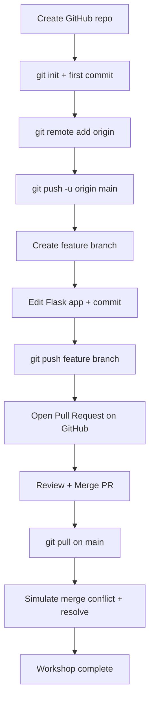
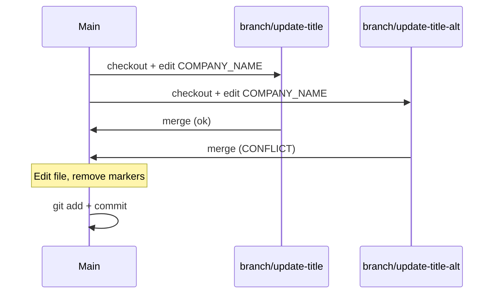

# Git Basics Workshop — 2-Hour Process Flow

> **Goal:** Learn `commit`, `push`, `pull`, `branch`, `merge`, and **Pull Request** using a simple Flask app that shows dummy employee data.

---

## Before You Start (5 min)

| Item | Action |
|------|--------|
| Git installed | Run `git --version` |
| Python 3.10+ | Run `python --version` |
| GitHub account | Log in at [github.com](https://github.com) |
| GitHub username | Replace `YOUR_GITHUB_USERNAME` everywhere in this workshop |

---

## High-Level Flow (Mermaid)



---

## Timeline Overview

| Time | Block | Git concepts |
|------|-------|--------------|
| 0:00 – 0:20 | Setup & first run | `init`, `status`, `add`, `commit` |
| 0:20 – 0:40 | Connect GitHub | `remote`, `push`, `pull`, `clone` |
| 0:40 – 1:00 | Branching | `branch`, `checkout`, `switch` |
| 1:00 – 1:25 | Pull Request | push branch, PR, code review |
| 1:25 – 1:45 | Merge & sync | merge PR, `git pull`, fast-forward |
| 1:45 – 2:00 | Conflict drill | `merge` conflict, resolve, commit |

---

## Block 1 — Setup & First Commit (0:00 – 0:20)

### 1.1 Run the Flask app locally

```powershell
cd d:\skill\basics_of_git
python -m venv venv
.\venv\Scripts\Activate.ps1
pip install -r requirements.txt
python app.py
```

Open **http://127.0.0.1:5000** — you should see the Team Directory table.

### 1.2 Initialize Git

```powershell
git init
git status
```

### 1.3 First commit

```powershell
git add .
git status
git commit -m "Initial commit: Flask team directory with dummy data"
git log --oneline
```

**Checkpoint:** `git log` shows 1 commit. Working tree is clean.

---

## Block 2 — GitHub Remote, Push & Pull (0:20 – 0:40)

### 2.1 Create empty repo on GitHub

1. Go to **GitHub → New repository**
2. Name: `git-basics-workshop` (or any name)
3. **Do NOT** add README, .gitignore, or license (we already have files)
4. Copy the HTTPS URL, e.g. `https://github.com/YOUR_GITHUB_USERNAME/git-basics-workshop.git`

### 2.2 Link remote and push

```powershell
git branch -M main
git remote add origin https://github.com/YOUR_GITHUB_USERNAME/git-basics-workshop.git
git remote -v
git push -u origin main
```

### 2.3 Practice pull (no changes on remote)

```powershell
git pull origin main
```

**Checkpoint:** Repo visible on GitHub with all project files.

---

## Block 3 — Branching (0:40 – 1:00)

### 3.1 Create feature branch

```powershell
git switch -c feature/add-role-badge
git branch
```

### 3.2 Make a small change

Open `templates/index.html` and add a **Role** badge next to each employee name (workshop hint in `WORKSHOP.md`).

```powershell
git status
git diff
git add templates/index.html
git commit -m "Add role badge to employee cards"
```

### 3.3 Push feature branch

```powershell
git push -u origin feature/add-role-badge
```

**Checkpoint:** Branch exists on GitHub. `main` is unchanged locally if you didn't merge yet.

---

## Block 4 — Pull Request (1:00 – 1:25)

### 4.1 Open PR on GitHub

1. GitHub repo → **Compare & pull request**
2. Base: `main` ← Compare: `feature/add-role-badge`
3. Title: `Add role badge to team directory`
4. Description: what you changed and why
5. **Create pull request**

### 4.2 Self-review

- Files changed tab
- Add a comment on one line (optional)
- **Approve** or leave as author

**Checkpoint:** PR is open; CI not required for this workshop.

---

## Block 5 — Merge & Pull (1:25 – 1:45)

### 5.1 Merge on GitHub

1. **Merge pull request** → Confirm merge
2. Optionally delete feature branch on GitHub

### 5.2 Sync local main

```powershell
git switch main
git pull origin main
git log --oneline --graph --all
```

### 5.3 Second feature (optional fast path)

```powershell
git switch -c feature/footer-copyright
```

Edit `templates/base.html` — add footer text. Commit and push, open PR #2, merge.

**Checkpoint:** Local `main` matches GitHub `main`.

---

## Block 6 — Merge Conflict Drill (1:45 – 2:00)

This is scripted in `WORKSHOP.md` — two branches edit the same line in `data.py`.



**Checkpoint:** You resolved `<<<<<<<` / `=======` / `>>>>>>>` markers once.

---

## Commands Cheat Sheet (quick reference)

| Task | Command |
|------|---------|
| See status | `git status` |
| Stage all | `git add .` |
| Stage one file | `git add path/to/file` |
| Commit | `git commit -m "message"` |
| View history | `git log --oneline --graph` |
| New branch | `git switch -c branch-name` |
| Switch branch | `git switch branch-name` |
| Push | `git push -u origin branch-name` |
| Pull | `git pull origin main` |
| See remotes | `git remote -v` |
| Undo unstaged edits | `git restore file` |
| See diff | `git diff` |

---

## Success Criteria (end of 2 hours)

- [ ] Flask app runs and shows dummy team data
- [ ] At least **2 commits** on `main`
- [ ] At least **1 feature branch** pushed to GitHub
- [ ] At least **1 Pull Request** merged on GitHub
- [ ] `git pull` used after merge
- [ ] One **merge conflict** resolved locally
- [ ] Can explain: working directory → staging → commit → push → PR → merge → pull

---

## Your GitHub Remote (fill in)

```
HTTPS: https://github.com/YOUR_GITHUB_USERNAME/git-basics-workshop.git
SSH:   git@github.com:YOUR_GITHUB_USERNAME/git-basics-workshop.git
```

Replace `YOUR_GITHUB_USERNAME` with your actual GitHub username before Block 2.
